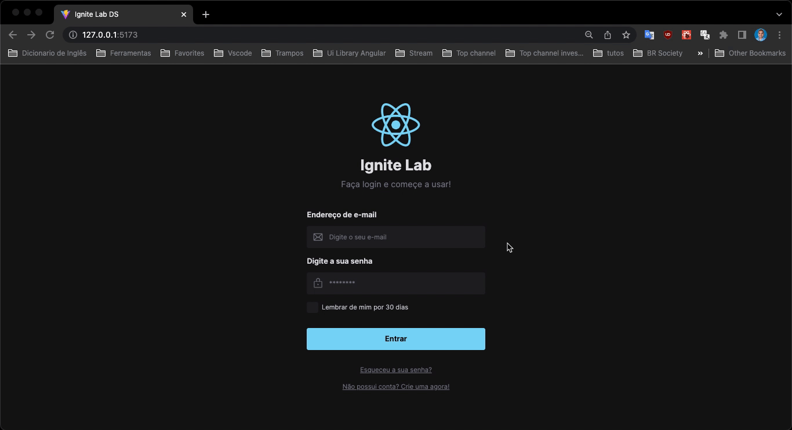

<h1 align="center">
    
</h1>

<p align="center">
  <a href="#technologies">Technologies</a>&nbsp;&nbsp;&nbsp;|&nbsp;&nbsp;&nbsp;
  <a href="#-layout">Getting started</a>&nbsp;&nbsp;&nbsp;|&nbsp;&nbsp;&nbsp;
  <a href="#-project">Project</a>&nbsp;&nbsp;&nbsp;|&nbsp;&nbsp;&nbsp;
  <a href="#-layout">Layout</a>&nbsp;&nbsp;&nbsp;|&nbsp;&nbsp;&nbsp;
  <a href="#-license">License</a>
</p>

<br>

<p align="center">
  
</p>

---

## 🧪 Technologies

This project was developed using the following technologies:

- [ReactJS](https://reactjs.org/)
- [Storybook](https://storybook.js.org/)
- Storybook Testing
- Mock Service Work
- [ViteJS](https://vitejs.dev/)
- [Radix](https://www.radix-ui.com/)
- [Typescript](https://www.typescriptlang.org/)
- [Tailwindcss](https://tailwindcss.com/)
- [Github Actions](https://docs.github.com/pt/actions)


## 🚀 Getting started

Clone the project and access the folder

```bash
$ git clone https://github.com/dyhalmeida/ignite-lab-ds.git && cd ignite-lab-ds
```

Follow the steps below
```bash
# Install the dependencies
$ yarn install

# Start the project
$ yarn dev

# Start the storybook
$ yarn storybook

# Run storybook test
$ yarn test-storybook
```

## 💻 Project

Application developed for the purpose of learning how to develop a design system and implement it with React and
You can access the storybook of this project **[here](https://dyhalmeida.github.io/ignite-lab-ds)**

This is a project developed during the Ignite Lab 03, presented by **[@Rocketseat](https://github.com/Rocketseat)** during Oct, 2022.

## 🔖 Layout

You can view the project layout through the links below:

- [Layout](https://www.figma.com/file/zWQUO0K7mLz4A9w1QCASxp/Ignite-Lab---DS?node-id=1%3A169) 

Remembering that you need to have a [Figma](http://figma.com/) account to access it.

## 📝 License

This project is licensed under the MIT License. See the [LICENSE](LICENSE.md) file for details.